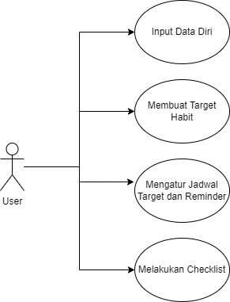
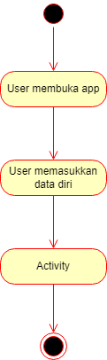
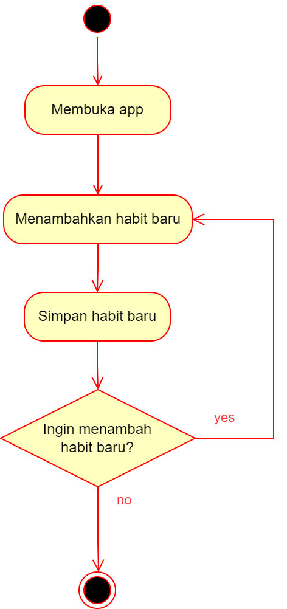
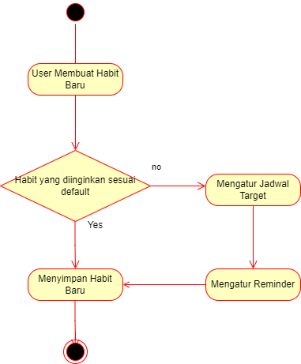
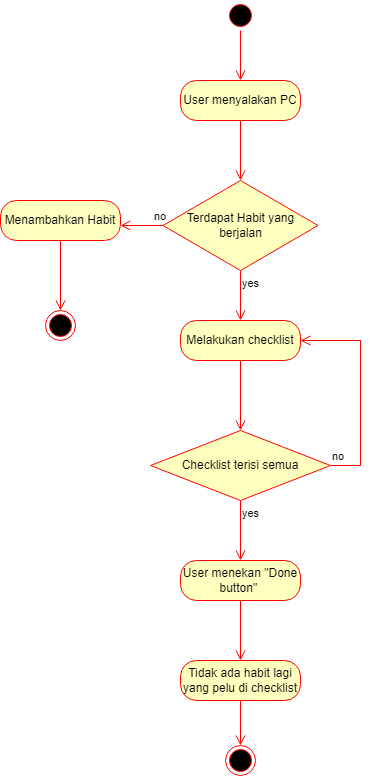
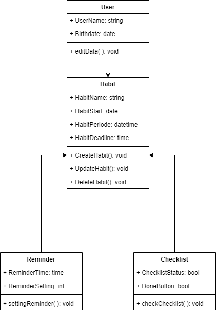
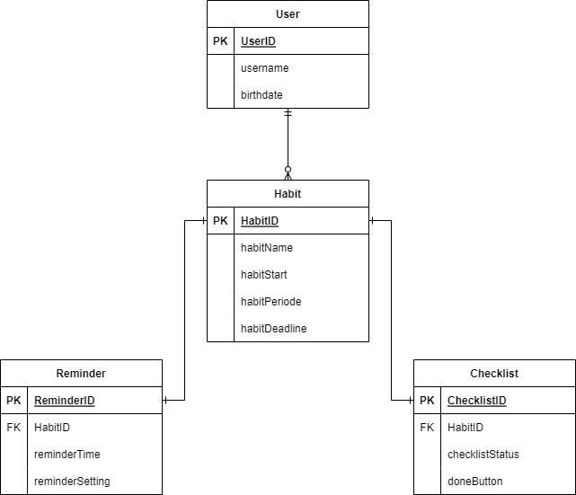

# HabitCorner

<h3>Habit Corner thrives to assist its user on building a healthy habit/lifestyle. This app is desktop application that will displayed in the corner of your home page. </h3>

Nama Kelompok : AFAyk

Ketua Kelompok :  Aulia Nur Fajriyah - 20/456360/TK/50490  (Software Architect)

Anggota 1 : Adhyaksa Zhalifunnas - 20/463586/TK/51578 (Back-End Developer)

Anggota 2 : Farhan Maulana Firmansyah - 20/460544/TK/51133 (Front-End Developer)

  
<h3>Use-Case</h3>

  

  
<h3>Activity Diagram</h3>

  

  

  

  
  

  
<h3>Class Diagram</h3>

  
  

  
<h3>Entity Relationship Diagram</h3>

  
  

View github page : https://aulianurfajriyah.github.io/HabitCorner/ 

